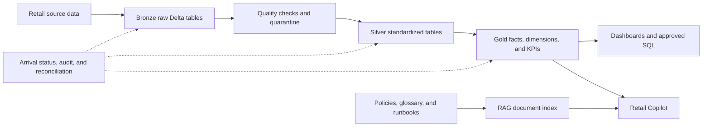

# NovaRetail Production Lakehouse and AI RAG Platform

NovaRetail is a production-only retail data platform on Databricks. It processes batch and streaming retail data through Bronze, Silver, and Gold layers, publishes certified business KPIs, monitors data arrival, and provides a citation-grounded Copilot.

Open the production chat: [NovaRetail Copilot](https://novaretail-copilot-7474648027961612.aws.databricksapps.com)

## Production status

- Unity Catalog: `novaretail_prod`
- Orders: 5,000,000
- Order items: 10,000,000
- Total Bronze rows: 26,601,000
- Production workflows: batch pipeline, available-now streams, big-data load, and RAG Copilot query
- Copilot: running and connected only to production Gold and governance tables
- Deployment target: `prod`

## Data flow



## Where the data is stored

All governed data is stored in the Databricks Unity Catalog `novaretail_prod`:

- `novaretail_prod.bronze`: raw accepted source data
- `novaretail_prod.silver`: cleaned and standardized business data
- `novaretail_prod.gold`: facts, dimensions, aggregates, and certified KPIs
- `novaretail_prod.governance`: arrival status, pipeline runs, quality, and audit evidence
- `novaretail_prod.rag`: RAG-related governed assets
- `novaretail_prod.platform`: production managed Volume and platform storage

See [big_data_rag_operations.md](docs/big_data_rag_operations.md) for the exact tables and monitoring queries.

## How the pipeline starts

The workflows are intentionally started manually so the Free Edition workspace does not consume compute unexpectedly.

1. Open Databricks **Jobs & Pipelines**.
2. Open the required workflow whose name starts with `novaretail-prod-`.
3. Select **Run now**.
4. Open the run and confirm every task is green.
5. Check `novaretail_prod.governance.data_arrival_status` to confirm the expected rows arrived.

The production workflows can also be run from the CLI:

```powershell
databricks bundle run --target prod retail_big_data_load
databricks bundle run --target prod rag_copilot_query
databricks bundle run --target prod retail_batch_pipeline
databricks bundle run --target prod retail_streaming_pipeline
```

## Production deployment

Install the application dependencies and validate the environment:

```powershell
python -m venv .venv
.\.venv\Scripts\Activate.ps1
python -m pip install --upgrade pip
pip install -r requirements.txt
python scripts\validate_environment.py
python scripts\validate_bundle.py
```

Deploy the single production bundle target:

```powershell
databricks bundle validate --target prod
databricks bundle plan --target prod
databricks bundle deploy --target prod
```

Deployment through GitHub is manual using [.github/workflows/databricks-deploy.yml](.github/workflows/databricks-deploy.yml). No workflow has an automatic schedule.

## Production Copilot

The Copilot answers two governed question types:

- Policy and operating questions are answered from indexed documents with citations.
- KPI and data questions use approved, read-only SQL against production Gold tables.

It does not answer unrelated general questions. This guardrail prevents unsupported answers and protects the data platform. See [rag_chat_app.md](docs/rag_chat_app.md) and [rag_copilot.md](docs/rag_copilot.md).

## Important files

- `databricks.yml`: the production-only Databricks bundle
- `configs/prod.yml`: production application and storage configuration
- `resources/lakehouse_jobs.yml`: production job definitions
- `src/retail_lakehouse/`: reusable pipeline and RAG application code
- `scripts/`: production operational entrypoints
- `apps/retail_copilot/`: production chat application
- `docs/`: operational and architecture documentation

Secrets, passwords, OAuth tokens, local data, build output, and Databricks state are excluded from Git.

## Git identity

The repository uses `prasanthhulk <prasanthpalle77@gmail.com>` as its repository-local Git identity. GitHub authentication uses OAuth through Git Credential Manager; passwords are not stored in this repository.

## License

This project is licensed under the MIT License. See [LICENSE](LICENSE).
