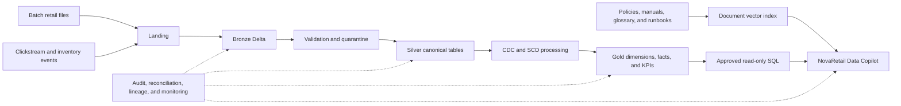

# NovaRetail Retail Intelligence Lakehouse and AI RAG Platform

NovaRetail is a production-style retail data engineering and AI portfolio project. It combines batch and streaming ingestion, Delta Lake medallion processing, dimensional analytics, data quality, observability, and a citation-grounded retail data copilot.

The repository is intentionally local-first. Core logic can be developed and tested on a Windows workstation, while Databricks-specific deployment assets will be added without coupling business logic to notebooks.

## Current status

- Phase 1 architecture and implementation plan: complete.
- Phase 2 repository foundation: complete.
- Milestone 2 synthetic sources, immutable Landing, and Delta Bronze: complete.
- Milestone 3 typed Silver, quality quarantine, CDC merge, and SCD Type 2: complete.
- Streaming, Gold analytics, RAG, and Databricks deployment: planned in later milestones.

See [docs/phase_1_plan.md](docs/phase_1_plan.md) for the full architecture, requirements, data model, controls, milestones, and acceptance checklist.

Implementation details and reproducible proofs are documented in [docs/landing_and_bronze.md](docs/landing_and_bronze.md) and [docs/silver_quality_and_scd.md](docs/silver_quality_and_scd.md).

## Solution flow



## Prerequisites

- Git
- Python 3.11 or 3.12
- Java 17 for local PySpark execution
- PowerShell 7 recommended on Windows
- Databricks Free Edition or a Databricks workspace for cloud milestones

Java is not required for the initial non-Spark unit tests.

Install a checksum-verified project-local Temurin 17 runtime on Windows with:

```powershell
powershell.exe -NoProfile -ExecutionPolicy Bypass -File .\scripts\setup_java.ps1
```

## Windows setup

```powershell
python -m venv .venv
.\.venv\Scripts\Activate.ps1
python -m pip install --upgrade pip
pip install -r requirements-dev.txt
python scripts\validate_environment.py
pytest
```

Install the full local lakehouse and RAG dependencies when those milestones begin:

```powershell
pip install -r requirements.txt
```

Install only the lakehouse dependencies with:

```powershell
pip install -r requirements-lakehouse.txt
```

Copy the environment template before running services:

```powershell
Copy-Item .env.example .env
```

Never commit `.env`, tokens, passwords, service-principal secrets, or cloud credentials.

## Configuration

Environment configuration lives in `configs/`. Application code loads `dev.yml` as the base configuration and applies the selected environment file over it.

```python
from retail_lakehouse.config.settings import load_settings

settings = load_settings("dev")
```

Set `NOVARETAIL_ENV` to `dev`, `test`, `staging`, or `prod`. Secrets are supplied separately through environment variables or Databricks secret scopes.

## Generate a synthetic source batch

The generator is deterministic by seed and creates customers, products, stores, suppliers, orders, order items, payments, inventory events, returns, promotions, shipments, and customer events. Invalid mode deliberately adds duplicates, broken keys, status errors, negative values, reconciliation errors, event duplication, and schema drift.

```powershell
python scripts\generate_data.py --seed 42 --customers 20 --products 15 --orders 30
python scripts\stage_landing.py "data\generated\batch_id=20260101T000000Z_seed42"
```

Running `stage_landing.py` again reports `ALREADY_STAGED` for the same checksums and does not copy the files twice.

## Run local Delta Bronze on Windows through WSL2

Native Windows Spark depends on Hadoop's unavailable official `winutils.exe` binary. The supported project workflow runs Spark inside the installed Ubuntu WSL2 distribution, while generation and Landing can run from PowerShell.

```powershell
wsl bash -lc "cd /mnt/c/Users/Orcon/OneDrive/Documents/Rag && python3 -m venv .venv-wsl"
wsl bash -lc "cd /mnt/c/Users/Orcon/OneDrive/Documents/Rag && .venv-wsl/bin/python -m pip install -r requirements-lakehouse.txt"
wsl bash -lc "cd /mnt/c/Users/Orcon/OneDrive/Documents/Rag && PYTHONPATH=src .venv-wsl/bin/python scripts/run_bronze_batch.py 20260101T000000Z_seed42"
```

The first Spark start retrieves the matching open-source Delta Lake runtime JARs from Maven Central. Later runs use the local dependency cache.

## Run typed Silver and quality controls

Process all 12 datasets in dependency order and reconcile the results:

```powershell
wsl bash -lc "cd /mnt/c/Users/Orcon/OneDrive/Documents/Rag && PYTHONPATH=src .venv-wsl/bin/python scripts/run_silver.py --dataset all --run-id SILVER-DEMO-SEED43"
wsl bash -lc "cd /mnt/c/Users/Orcon/OneDrive/Documents/Rag && PYTHONPATH=src .venv-wsl/bin/python scripts/verify_silver.py SILVER-DEMO-SEED43"
```

Silver uses executable YAML rules for row validity and cross-table relationships. Failed rows retain their rule IDs in Delta quarantine; rule-level counts and failure percentages are persisted under the Silver quality-results table.

## Repository conventions

- Reusable logic belongs in `src/retail_lakehouse/`.
- Notebooks are orchestration and exploration surfaces, not the home of business logic.
- SQL assets belong in `sql/`.
- Generated data, checkpoints, logs, local warehouses, and secrets are excluded from Git.
- All timestamps are UTC unless a documented business calculation requires another timezone.
- Every pipeline uses deterministic identifiers, audit metadata, and idempotent writes.

## Git identity

This repository uses repository-local Git identity settings so it can remain separate from company repositories. Authentication to GitHub uses OAuth through Git Credential Manager; passwords are never stored in this project.

## License

This project is licensed under the MIT License. See [LICENSE](LICENSE).
