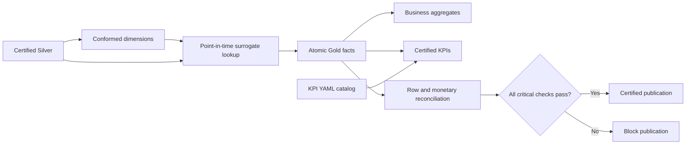

# Gold Dimensional Analytics and Certified KPIs

## Objective

Milestone 4 publishes governed business-facing Delta tables from accepted Silver records. The layer uses conformed surrogate keys, historical dimension lookup at event time, replay-safe snapshot synchronization, explicit special members, centralized KPI definitions, and publication-blocking reconciliation.

## Published model

Dimensions:

- `dim_customer`, `dim_product`, `dim_store`, and `dim_supplier` use SCD Type 2.
- `dim_date` provides a complete calendar across observed business dates.
- `dim_channel` is a governed mini-dimension.
- `dim_promotion` provides deterministic promotion keys and attribution attributes.

Facts:

- `fact_sales` at one order per row.
- `fact_order_items` at one certified order line per row.
- `fact_payments`, `fact_returns`, `fact_shipments`, and `fact_customer_events` at source-event grain.
- `fact_inventory_movements` at inventory-event grain.
- `fact_inventory_snapshot` at the latest product-store observation.

Aggregates and KPI products:

- `agg_daily_store_sales`, `agg_daily_product_sales`, and `agg_channel_funnel`.
- `agg_inventory_health`, `agg_supplier_performance`, and `agg_promotion_performance`.
- `retail_kpi_daily` and `retail_kpi_periodic`.
- `_kpi_catalog` and `_reconciliation_results` governance tables.



## Historical and referential behavior

Fact keys are stable hashes of the fact name and source business key. Customer, product, store, and supplier keys resolve to the dimension version whose validity interval contains the fact event timestamp. Missing business keys use the Not Applicable member; non-null unmatched keys use Unknown. This preserves fact rows without inventing relationships.

Gold customer contact data is masked before publication. Raw email, phone, and street address are not selected into `dim_customer`.

Order items are published only when their parent order passed Silver certification. The row-count reconciliation records excluded lines explicitly. Payments, events, shipments, and other independently meaningful events remain available with Unknown dimension keys when their optional relationship cannot be resolved.

## KPI governance

`configs/kpi_definitions.yml` is the central business catalog. Each definition includes display name, grain, plain-language formula, certified table and measure column, and owner. Pipeline calculations use divide-by-zero-safe formulas and publish both daily and monthly finance metrics.

The key finance relationship is:

```text
net_revenue = gross_sales + tax_revenue + shipping_revenue - discounts - refunds
```

## Replay and reconciliation

Derived facts, aggregates, and KPI tables synchronize by stable identifiers: matches update, new rows insert, and rows absent from the latest certified snapshot are removed. Replaying the same Silver state does not duplicate Gold rows.

Before returning success, the pipeline records source, published, and intentionally excluded row counts for every fact. It also compares Silver order net amount to Gold sales net amount exactly. Any failed critical reconciliation raises an error instead of certifying the run.

## Commands

Publish Gold from the current Silver Delta tables:

```powershell
wsl bash -lc "cd /mnt/c/Users/Orcon/OneDrive/Documents/Rag && PYTHONPATH=src .venv-wsl/bin/python scripts/run_gold.py --run-id GOLD-DEMO-SEED43"
```

Run durable Linux Spark/Delta verification through GitHub Actions with `.github/workflows/lakehouse-integration.yml`.

Example business queries are in `sql/gold/example_analytics.sql`.
