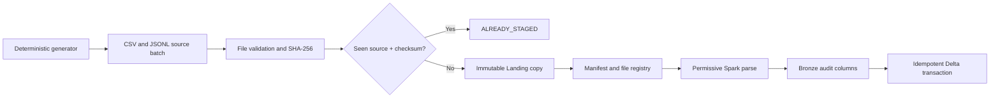

# Synthetic Sources, Landing, and Bronze

## Objective

Milestone 2 produces reproducible retail inputs, preserves delivered files exactly, captures file-level evidence, and commits parsed records to replay-safe Delta Bronze datasets.

## Synthetic data contract

The generator writes five CSV sources and seven JSON Lines sources. A `generation_report.json` file records seed, reference time, batch ID, paths, counts, and every deliberately injected defect.

The default invalid scenarios are:

- duplicate customer business key and malformed email
- negative product price
- unknown order customer, invalid status, and total mismatch
- negative order-item quantity
- invalid payment status
- negative inventory quantity
- return quantity exceeding the purchase
- delivery timestamp before shipment
- duplicate customer event and unexpected schema field

The same options and seed produce byte-identical source files, allowing deterministic replay and recovery.

## Landing guarantees

1. Reject missing, empty, or unsupported files.
2. Calculate SHA-256 incrementally.
3. Identify a delivery by source name plus checksum.
4. Copy through a temporary file and atomically rename it.
5. Never replace a target with different content.
6. Write a JSON manifest containing source, destination, size, timestamps, checksum, run ID, and batch ID.
7. Register the file atomically in the local control registry.
8. Return `ALREADY_STAGED` for replayed content.

Databricks mode will replace the JSON registry with a Delta `processed_files` control table while keeping the manifest contract.

## Bronze guarantees

- Parse CSV and JSON Lines in permissive mode.
- Preserve Landing as the immutable raw evidence.
- Retain `_corrupt_record` when parsing fails.
- Add record hash, source file, file size, modification timestamp, checksum, ingestion time, run ID, batch ID, source system, and schema version.
- Store each source in its own Delta path.
- Use a Delta application transaction derived from dataset plus checksum with transaction version `1`.
- Replaying the same file therefore reuses the same transaction identity and does not append rows twice.

## Execution flow



## Local commands

Generate and stage from PowerShell:

```powershell
.\.venv\Scripts\python.exe scripts\generate_data.py --seed 42
.\.venv\Scripts\python.exe scripts\stage_landing.py "data\generated\batch_id=20260101T000000Z_seed42"
```

Run all Bronze datasets from WSL:

```powershell
wsl bash -lc "cd /mnt/c/Users/Orcon/OneDrive/Documents/Rag && PYTHONPATH=src .venv-wsl/bin/python scripts/run_bronze_batch.py 20260101T000000Z_seed42"
wsl bash -lc "cd /mnt/c/Users/Orcon/OneDrive/Documents/Rag && PYTHONPATH=src .venv-wsl/bin/python scripts/verify_bronze.py data/generated/batch_id=20260101T000000Z_seed42"
```
