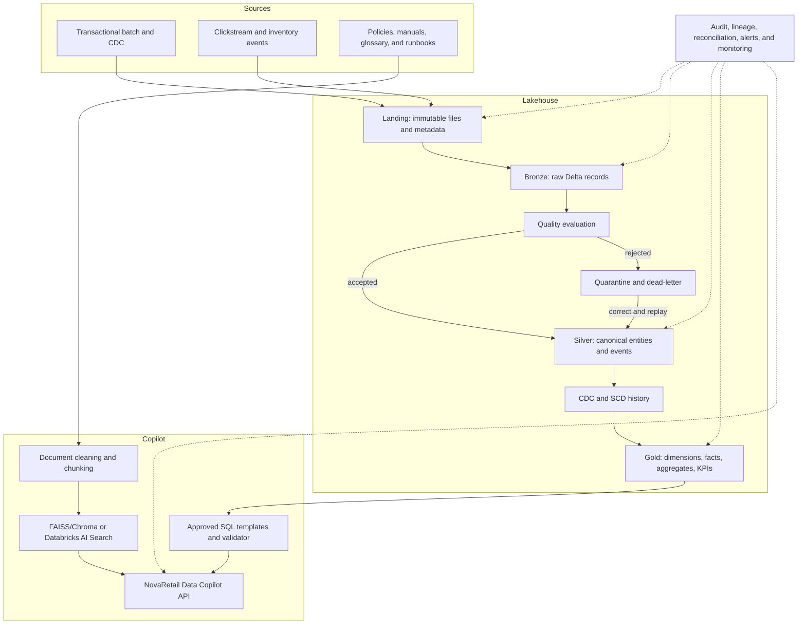
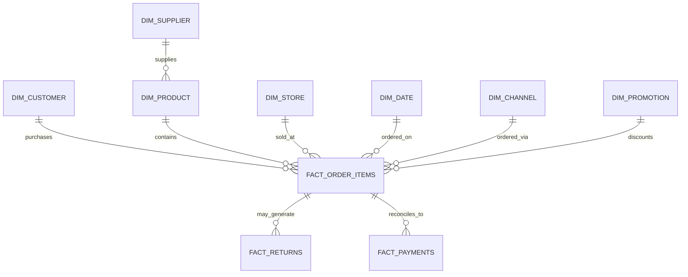

# Phase 1 - Architecture and Implementation Plan

## 1. Project overview

NovaRetail is a fictional multi-channel retailer operating physical stores, e-commerce, mobile applications, and marketplace channels. The platform creates a single governed source of retail truth and a citation-grounded assistant for analysts and operations teams.

The implementation uses a medallion lakehouse, dimensional Gold models, configuration-driven controls, and hybrid RAG. It must run locally for development and also expose Databricks-compatible deployment paths.

## 2. Business problem

Retail data is fragmented across transactional systems, digital events, inventory feeds, supplier processes, and documents. The resulting challenges include inconsistent metrics, slow incident investigation, duplicate and late records, weak lineage, and answers that cannot be traced to trusted evidence.

NovaRetail needs repeatable pipelines that preserve raw evidence, produce auditable business tables, and let authorized users ask both numerical and policy questions safely.

## 3. Functional requirements

1. Generate realistic valid and invalid synthetic retail data.
2. Ingest batch files and simulated streaming events.
3. Preserve received data and ingestion metadata in Landing and Bronze.
4. Standardize, deduplicate, validate, quarantine, and reconcile data in Silver.
5. Support full loads, incremental loads, CDC, deletes, backfills, replay, and retries.
6. Implement SCD Type 2 for customer, product, store, and supplier dimensions.
7. Create Gold dimensions, facts, aggregates, and retail KPIs.
8. Track file processing, watermarks, audit results, schema changes, and failures.
9. Demonstrate effectively-once stream processing with checkpoints and event IDs.
10. Index business documents for semantic retrieval with source metadata.
11. Answer numerical questions only through approved read-only Gold queries.
12. Combine structured and unstructured evidence when appropriate.
13. Evaluate RAG retrieval, groundedness, citation correctness, and SQL accuracy.
14. Run automated unit, integration, end-to-end, security, and idempotency tests.
15. Deploy through GitHub Actions and Databricks Asset Bundles in later phases.

## 4. Non-functional requirements

- **Correctness:** monetary reconciliation uses documented tolerances and decimal-safe logic.
- **Idempotency:** replaying the same file, event, or batch produces no business duplication.
- **Auditability:** every execution has a run ID, timestamps, counts, status, and source metadata.
- **Recoverability:** checkpoints, file tracking, quarantine, backfill, and Delta time travel support recovery.
- **Security:** least privilege, PII masking, secret isolation, and read-only RAG SQL.
- **Maintainability:** configuration and reusable packages hold logic; notebooks orchestrate only.
- **Portability:** local paths and Databricks object names are selected through configuration.
- **Performance:** incremental processing, appropriate partitioning, optimized writes, and query-plan inspection.
- **Observability:** freshness, latency, quality, reconciliation, streaming lag, and RAG quality are measurable.
- **Testability:** pure transformations are isolated from Spark I/O wherever practical.

## 5. Assumptions

- Source timestamps are converted to UTC and the original value is retained in Bronze.
- USD is the initial reporting currency; exchange-rate conversion is a later extension.
- Synthetic data contains no real customer PII.
- Local execution uses small datasets and file-based simulated streams.
- Databricks Free Edition may not support every production security or networking feature; unsupported features are documented and represented as deployable configuration examples.
- Order and event business keys are stable within their source systems.
- Deletes arrive as CDC operation markers rather than physical file removal.

## 6. Architecture



## 7. Data-source inventory

| Domain | Sources | Mode | Typical cadence |
|---|---|---|---|
| Customer | customers | snapshot + CDC | daily/incremental |
| Product | products, promotions | snapshot + CDC | daily |
| Location | stores | snapshot + CDC | daily |
| Supply | suppliers, shipments | CDC/incremental | hourly/daily |
| Commerce | orders, order_items, payments, returns | incremental + CDC | hourly |
| Inventory | inventory events | streaming | near real time |
| Digital | views, searches, cart, checkout, purchase events | streaming | near real time |
| Knowledge | policies, manuals, glossary, dictionary, runbooks | document batch | on change |

The authoritative source settings are maintained in `configs/source_config.yml`.

## 8. Layer and table inventory

### Landing

Raw files remain byte-for-byte unchanged. A manifest captures source, file path, size, modification time, checksum, ingestion time, batch ID, and pipeline run ID.

### Bronze

- `bronze_customers`, `bronze_products`, `bronze_stores`, `bronze_suppliers`
- `bronze_orders`, `bronze_order_items`, `bronze_payments`, `bronze_returns`
- `bronze_promotions`, `bronze_shipments`, `bronze_inventory_events`
- `bronze_customer_events`
- `_rescued_data`, source schema version, record hash, source file, batch ID, run ID, and ingestion timestamp are retained.

### Silver

- `silver_customers`, `silver_products`, `silver_stores`, `silver_suppliers`
- `silver_orders`, `silver_order_items`, `silver_payments`, `silver_returns`
- `silver_promotions`, `silver_shipments`, `silver_inventory_movements`
- `silver_customer_events`
- `quarantine_<dataset>` for rejected records with failed rule IDs and repair status.

### Gold

Dimensions:

- `dim_customer`, `dim_product`, `dim_store`, `dim_supplier`
- `dim_date`, `dim_promotion`, `dim_channel`

Facts:

- `fact_sales`, `fact_order_items`, `fact_payments`, `fact_returns`
- `fact_inventory_movements`, `fact_inventory_snapshot`, `fact_shipments`
- `fact_customer_events`

Aggregates:

- `agg_daily_store_sales`, `agg_daily_product_sales`, `agg_channel_funnel`
- `agg_inventory_health`, `agg_supplier_performance`, `agg_promotion_performance`
- `retail_kpi_daily`, `retail_kpi_periodic`

Control and monitoring:

- `pipeline_run_audit`, `pipeline_task_audit`, `pipeline_control`
- `processed_files`, `schema_change_log`, `data_quality_results`
- `reconciliation_results`, `pipeline_alerts`, `rag_query_log`, `rag_evaluation_results`

## 9. Dimensional model

`fact_order_items` is the atomic sales grain: one order item. `fact_sales` is an order-level convenience fact. Facts reference the dimension version effective at the business event timestamp, not necessarily the dimension version current during processing.



Surrogate keys are deterministic where practical. Unknown and not-applicable members are explicit to preserve fact referential integrity.

## 10. Data-quality strategy

Quality rules are configuration-driven. Each rule contains dataset, expression, severity, tolerance, action, owner, and description. Execution produces one result row per rule and stores sampled failures separately from the main result.

- INFO and WARNING rules log and continue.
- ERROR rules generally quarantine the record and continue within tolerance.
- CRITICAL rules fail the pipeline if their configured tolerance is exceeded.
- Quarantine preserves original payload, normalized payload when available, failed rules, reason, run ID, and repair state.
- Corrected records re-enter through a controlled replay job using the original deterministic key.

Reconciliation compares source-to-Bronze, Bronze-to-Silver, and Silver-to-Gold counts and amounts. Critical monetary differences stop publication of affected Gold partitions.

## 11. Idempotency strategy

- File checksum plus source path prevents duplicate file ingestion.
- Batch IDs and pipeline run IDs separate input identity from execution identity.
- Event IDs plus event-time watermarking prevent duplicate streaming events.
- Canonical record hashes distinguish material changes from replayed rows.
- Delta `MERGE` matches deterministic business keys and operation sequence.
- SCD processing checks effective interval and record hash before inserting a new version.
- Gold facts merge by stable fact keys rather than append blindly.
- Audit writes merge by run ID and task name.
- Tests execute the same file, event, batch, and SCD update twice and assert unchanged business results.

## 12. CDC and SCD strategy

CDC records normalize insert, update, and delete operations and order conflicting changes by source sequence, source update timestamp, and ingestion timestamp. Only a successful transaction advances the control-table watermark.

Customer, product, store, and supplier use SCD Type 2 for historically important attributes. Each version contains:

- surrogate key and business key
- `effective_from` and `effective_to`
- `is_current`
- canonical `record_hash`
- `created_at`, `updated_at`, and source audit metadata

Unchanged hashes produce no new version. A material update closes the active interval immediately before the new interval. Late changes split the correct historical interval instead of overwriting current history. Reprocessing the same change is a no-op. Operational corrections that do not affect historical analysis use SCD Type 1.

## 13. RAG architecture

The assistant uses two controlled retrieval paths:

1. **Unstructured retrieval:** clean, classify, chunk, embed, index, filter, retrieve, and optionally rerank documents. Every chunk carries document ID, version, section, effective date, security class, and source URI.
2. **Structured retrieval:** map supported analytical intents to approved SQL templates or generate SQL under an allowlist. Parse and validate the query, reject mutations, limit rows, restrict catalogs/schemas/tables, and return the executed SQL with results.

The answer generator receives only authorized evidence. It must cite evidence, state when evidence is insufficient, avoid PII, and log question, retrieval, SQL, answer, latency, token usage, and safety outcomes. Retrieved content is treated as untrusted data and cannot override system instructions.

Local mode uses Chroma or FAISS-compatible storage and a configurable local model. Databricks mode uses AI Search/Vector Search and MLflow where the workspace supports them.

## 14. Security and governance

- Catalogs are environment-specific: `novaretail_dev`, `novaretail_test`, `novaretail_staging`, and `novaretail_prod`.
- Schemas separate Bronze, Silver, Gold, governance, and RAG assets.
- Roles include data engineer, analytics engineer, data analyst, data scientist, retail operations, finance, and platform administrator.
- Raw PII is restricted; analyst tables expose masked email and phone values.
- Row filters can restrict store or regional users.
- Secrets live in environment variables locally and Databricks secret scopes in cloud environments.
- Service principals, not personal accounts, perform production deployments.
- Retention and deletion workflows propagate approved privacy requests while maintaining non-identifying audit evidence.
- RAG retrieval enforces the same authorization boundary as direct table access.

## 15. Testing strategy

### Unit

Configuration, hashing, normalization, formulas, deduplication, SCD interval logic, quality rules, and SQL safety.

### Integration

Landing-to-Bronze, Bronze-to-Silver, Silver-to-Gold, Delta merge, CDC, quarantine, backfill, streaming restart, and vector retrieval.

### End to end

Data generation through KPI production and RAG answering, including audit and reconciliation evidence.

### Mandatory resilience and safety cases

Duplicate file/event/batch, late event, schema addition, missing field, corrupt record, incorrect total, SCD replay, checkpoint restart, SQL injection, prompt injection, insufficient evidence, and citation correctness.

## 16. CI/CD strategy

Pull requests run formatting, linting, type checking, YAML validation, security scanning, unit tests, and coverage. Integration tests use a small local Spark dataset or an isolated Databricks development target. Deployments use Databricks Asset Bundles and environment protection:


No password or long-lived personal credential belongs in GitHub Actions. Workload identity federation or scoped service-principal secrets are used according to the target workspace capabilities.

## 17. Repository structure

```text
configs/                 environment, source, quality, and KPI configuration
data/                    sample inputs, documents, and ignored runtime data
docs/                    architecture, mappings, glossary, security, and runbooks
notebooks/               thin orchestration and exploration notebooks
resources/               Databricks bundle resources
scripts/                 local entry points and environment validation
sql/                     DDL, transformation, KPI, quality, and monitoring SQL
src/retail_lakehouse/    reusable application and data engineering packages
tests/                   unit, integration, and end-to-end verification
terraform/               optional infrastructure examples
```

## 18. Implementation milestones

| Milestone | Deliverable | Exit condition |
|---|---|---|
| M1 | Planning and foundation | Documentation, configuration loader, logging, hashing, audit model, validation, and CI pass |
| M2 | Synthetic data and Bronze | Valid/invalid data generation, manifests, replayable Bronze ingestion, file tracking |
| M3 | Silver and controls | Standardization, quality, quarantine, CDC, SCD, reconciliation, idempotency tests |
| M4 | Gold analytics | Dimensions, facts, aggregates, KPI catalog, example analytical queries |
| M5 | Streaming | Clickstream/inventory streams, checkpoints, watermarks, late data, micro-batch KPIs |
| M6 | RAG copilot | Document and SQL retrieval, API, citations, guardrails, evaluation set |
| M7 | Databricks delivery | Asset Bundles, workflows, governance examples, deployment and recovery guides |

## 19. Risks and mitigations

| Risk | Impact | Mitigation |
|---|---|---|
| Local hardware cannot process enterprise volumes | Slow or failed development runs | Generate scaled datasets and test logic at small volume; run performance scenarios in Databricks |
| Free Databricks quotas restrict production features | Some controls cannot be executed directly | Implement local equivalents and version deployable examples with clearly documented limits |
| Business formulas drift between code and dashboards | Conflicting KPIs | Central KPI configuration, tested calculation functions, and certified Gold tables |
| Late CDC produces invalid dimension intervals | Incorrect historical reporting | Sequence changes deterministically and test interval splitting and replay |
| RAG fabricates metrics | Loss of trust | Numerical answers only from executed approved SQL; require citations and insufficient-evidence fallback |
| PII leaks into documents, logs, or prompts | Security incident | Synthetic data, masking, metadata classification, redaction, and restricted retrieval |
| Large dependency stack slows onboarding | Poor developer experience | Separate foundation, local lakehouse, RAG, and development dependency groups |
| Secrets enter Git history | Credential compromise | `.gitignore`, secret scanning, environment templates, pre-commit checks, and immediate key rotation |

## 20. Acceptance checklist

- [x] Business, functional, and non-functional requirements documented.
- [x] Overall architecture and data flow documented.
- [x] Sources and target table inventory defined.
- [x] Dimensional model and fact grain defined.
- [x] Data-quality and reconciliation strategies defined.
- [x] Idempotency, CDC, and SCD strategies defined.
- [x] RAG, security, testing, and CI/CD strategies defined.
- [x] Repository structure and milestones defined.
- [ ] Synthetic data generation is runnable.
- [ ] Batch and streaming Bronze ingestion are runnable.
- [ ] Silver cleaning, CDC, SCD, and quarantine are runnable.
- [ ] Gold dimensions, facts, aggregates, and KPIs are runnable.
- [ ] Audit and reconciliation tables are populated.
- [ ] Automated tests prove idempotency and recovery.
- [ ] RAG indexing, structured retrieval, citations, and guardrails are runnable.
- [ ] Databricks deployment assets validate and deploy to development.
- [ ] Operations, security, deployment, recovery, and RAG evaluation reports are complete.
