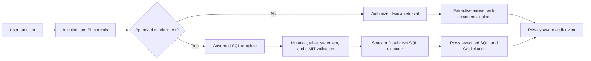

# NovaRetail Data Copilot

Milestone 6 adds a citation-grounded retail copilot that runs locally without a paid model or embedding API. It has two evidence paths: governed Markdown documents for policy and operational questions, and pre-reviewed read-only SQL templates for numerical Gold analytics.

## Safety and evidence flow



Retrieved text is always treated as untrusted data. Instruction-like passages are excluded during indexing, user prompt-override attempts are refused, direct identifiers are redacted from audit questions, and document security classifications are applied before scoring. Unknown questions return an insufficient-evidence response.

Numerical answers cannot be synthesized from prose. A question must match an intent in `configs/rag_sql_templates.yml`; only that reviewed query can execute. The validator rejects mutations, comments, multiple statements, unapproved tables, and excessive or missing row limits. Responses return the executed SQL and Gold source URI.

## Run locally at no API cost

The default BM25-style lexical index uses Python and PyYAML only. It is deterministic, fast enough for the included knowledge base, and requires no account, key, model download, or per-token charge.

```powershell
python scripts\index_documents.py
python scripts\ask_copilot.py "How many days can I return an unopened item?"
python scripts\evaluate_rag.py
```

The command-line copilot answers document questions immediately. Certified metric questions deliberately report that an analytics executor is unavailable until Spark or Databricks SQL is connected; this prevents fabricated values.

Install the optional API dependencies and start FastAPI with:

```powershell
pip install -e ".[rag]"
python scripts\run_copilot_api.py
```

Then call `GET /health` or `POST /ask` with JSON such as `{"question":"What is the return window?"}`. The service owner fixes the authorized security classes when creating the API; clients cannot self-elevate by supplying a classification. Audit events are appended to `logs/rag_queries.jsonl`, which is excluded from Git.

## Governed document contract

Each Markdown source under `data/documents/` starts with YAML metadata containing `document_id`, `title`, `version`, `effective_date`, `security_class`, and `source_uri`. Chunk identifiers include the document version, section, ordinal, and content hash, so rebuilds are reproducible and content changes create new IDs.

## Evaluation

`configs/rag_evaluation.yml` covers correct document retrieval, citation source correctness, insufficient evidence, prompt injection, and safe behavior when a SQL executor is absent. Unit tests additionally prove SQL injection controls, confidentiality filtering, PII redaction, stable indexing, and the requirement that metric answers originate from executed approved SQL.
