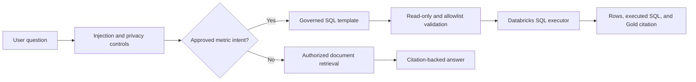

# NovaRetail production RAG Copilot

The Copilot has two evidence routes: governed Markdown documents for policies and operations, and approved read-only SQL templates for production Gold analytics.

Retrieved text is treated as untrusted data. Prompt-override attempts are refused, direct identifiers are redacted from audit questions, and document security classifications are applied before retrieval. Unknown questions return an insufficient-evidence response.

Numerical answers cannot be invented from prose. A question must match an intent in `configs/rag_sql_templates.yml`; only that reviewed query can execute. The validator rejects mutations, comments, multiple statements, unapproved tables, and excessive or missing row limits.

Each document under `data/documents/` includes a document ID, title, version, effective date, security class, and source URI. Responses expose citations so the user can inspect the source used for an answer.

Open the production interface at [NovaRetail Copilot](https://novaretail-copilot-7474648027961612.aws.databricksapps.com).
