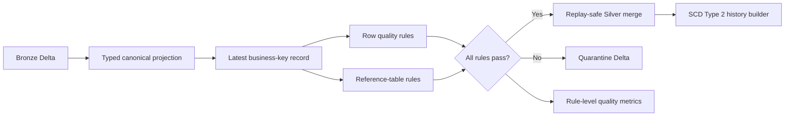

# Silver Quality, Quarantine, CDC, and SCD

## Objective

Milestone 3 converts permissive Bronze records into typed canonical Delta tables without silently dropping defects. It also establishes the reusable current-state merge and SCD Type 2 history logic required by downstream dimensions.

## Processing contract

For each of the 12 retail datasets, the pipeline:

1. casts raw strings into the registered canonical schema;
2. trims strings and normalizes configured status/code fields to uppercase;
3. retains Bronze lineage and adds a canonical record hash and processing time;
4. deterministically selects the latest record per business key;
5. evaluates active YAML quality rules in one Spark aggregation;
6. separates accepted records from quarantined records with failed rule IDs;
7. applies replay-safe Delta upserts/deletes to current Silver state;
8. merges quarantined records by deterministic quarantine ID; and
9. persists one auditable metric per run, dataset, and rule.



## Quality behavior

Rules live in `configs/data_quality_rules.yml`. Supported types are `not_null`, `regex`, `accepted_values`, `range`, `consistency`, `reference_exists`, and `reference_comparison`. Each rule declares severity, tolerated failure rate, action, description, and owner.

SQL rule expressions are treated as pass conditions. A false or null result fails the rule. Multiple failures remain attached to one quarantined row through `_failed_rule_ids`. Cross-table checks require upstream Silver tables, making dependency order explicit rather than allowing broken relationships.

The seed-43 demonstration produced this reconciliation:

| Measure | Rows |
|---|---:|
| Bronze input | 144 |
| Accepted Silver | 130 |
| Quarantined | 12 |
| Deterministic duplicates removed | 2 |
| Reconciled | 144 |

The deliberately malformed rows were caught. Referential enforcement also quarantined dependent records that pointed to a customer or order line already rejected by an upstream rule; this explains why quarantine count can exceed the number of directly injected invalid values.

## CDC current state

`merge_current_state` matches configured business keys and only changes a target when the incoming event timestamp is newer, or when the timestamp is equal and the canonical record hash differs. Replaying an identical event therefore does not update state. Datasets with `cdc_operation` also support conditional deletes without inserting delete tombstones as current records.

## SCD Type 2 history

`build_scd2_history` reconstructs valid-time history from existing and incoming versions. It deduplicates replayed effective timestamps, removes consecutive unchanged attribute hashes, inserts late-arriving changes in chronological position, closes the previous version one microsecond before the next version, marks exactly one current row, and creates a deterministic surrogate key.

## Local commands

Run every dataset from WSL in dependency order:

```powershell
wsl bash -lc "cd /mnt/c/Users/Orcon/OneDrive/Documents/Rag && PYTHONPATH=src .venv-wsl/bin/python scripts/run_silver.py --dataset all --run-id SILVER-DEMO-SEED43"
```

Reconcile all outputs and list failed rules:

```powershell
wsl bash -lc "cd /mnt/c/Users/Orcon/OneDrive/Documents/Rag && PYTHONPATH=src .venv-wsl/bin/python scripts/verify_silver.py SILVER-DEMO-SEED43"
```
