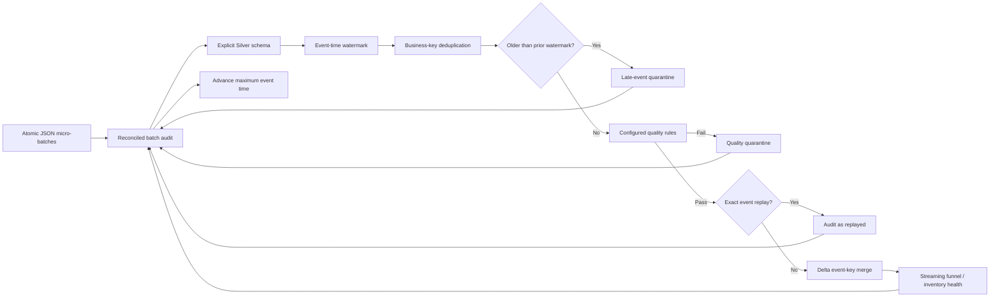

# Checkpointed Retail Structured Streaming

## Objective

Milestone 5 processes customer behavior and inventory events continuously from file-backed simulated streams. The implementation uses Spark Structured Streaming, durable checkpoints, event-time watermarks, deterministic late-data controls, stable Delta merges, quality quarantine, batch reconciliation, and continuously refreshed serving aggregates.

## Execution flow



## Effectively-once guarantees

- The checkpoint records files already consumed by each query.
- Raw events merge into `bronze/<dataset>_streaming` by a payload-derived record ID before any quality or lateness decision.
- `maxFilesPerTrigger` bounds local micro-batches.
- Business event IDs are the target merge keys, so losing a checkpoint and replaying source files does not duplicate Silver state.
- Canonical record hashes distinguish exact replays from legitimate updates to an existing event ID.
- Within-batch duplicates are ordered deterministically by event time and record hash.
- Every audit must reconcile input rows to duplicates, late rows, quality failures, exact replays, and merged rows.
- Batch audit and stream-control rows merge by deterministic identifiers.

## Watermark and late data

The configured maximum event timestamp is persisted under Silver `_stream_control`. At the start of each new micro-batch, the prior maximum minus `allowed_lateness_hours` becomes the deterministic cutoff. Records older than that cutoff are stored in `quarantine/stream_late/<dataset>` with `STREAM_LATE_EVENT`; they are not silently discarded.

Spark's query also declares the same event-time watermark. The explicit persisted cutoff makes late-data decisions inspectable and consistent across query restarts.

## Serving outputs

- `gold/streaming_channel_funnel` contains eligible, view, cart, and purchase sessions plus conversion rate by date and device.
- `gold/streaming_inventory_health` contains current product observations, stockouts, below-reorder observations, on-hand quantity, and stockout rate by date and store.
- `silver/_stream_batch_audit` contains operational counts and reconciliation status.
- `silver/_stream_control` contains maximum event time, allowed lateness, and last successful batch.

## Local commands

Run a continuous customer-event query in one WSL terminal:

```powershell
wsl bash -lc "cd /mnt/c/Users/Orcon/OneDrive/Documents/Rag && PYTHONPATH=src .venv-wsl/bin/python scripts/run_stream.py customer_events data/stream/customer_events --continuous"
```

Emit generated events as small atomic files from another terminal:

```powershell
python scripts/simulate_stream.py data/generated/batch_id=20260101T000000Z_seed43/customer_events.jsonl data/stream/customer_events --records-per-file 5 --interval-seconds 2
```

Run inventory in available-now mode to consume all currently available files and stop:

```powershell
wsl bash -lc "cd /mnt/c/Users/Orcon/OneDrive/Documents/Rag && PYTHONPATH=src .venv-wsl/bin/python scripts/run_stream.py inventory_events data/stream/inventory_events"
```

Keep checkpoints during normal restart and deployment. If a checkpoint is irrecoverable, preserve it for investigation, start with a new checkpoint path, and replay the immutable stream files; stable Delta keys prevent business duplication.
